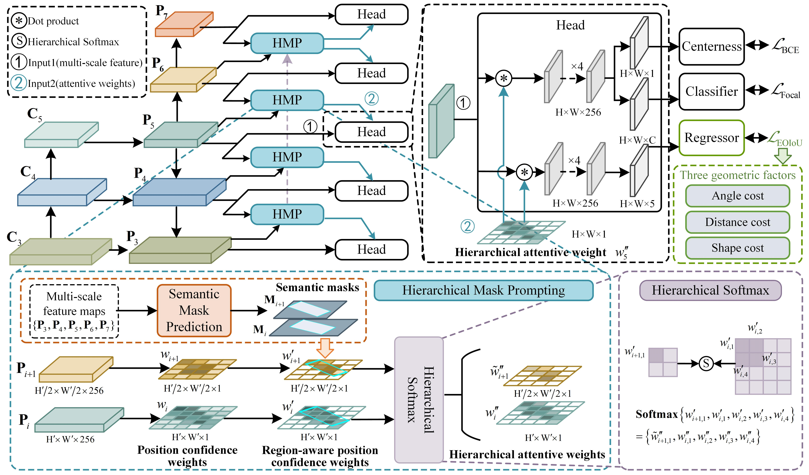

# [Hierarchical Mask Prompting and Robust Integrated Regression for Oriented Object Detection](https://arxiv.org/)

Yanqing Yao, Gong Cheng, Member, IEEE, Chunbo Lang, Xiang Yuan, Xingxing Xie, and Junwei Han, Fellow, IEEE

## Introduction

Object detection in remote sensing images has garnered significant attention due to its wide applications in real-world scenarios. However, most existing oriented object detectors still suffer from complex backgrounds and varying angles, limiting their performance to further improvement. In this paper, we propose a novel oriented detector with Hierarchical mask prompting and Robust integrated regression, termed HRDet. Specifically, to cope with the first issue, we construct a hierarchical mask prompting module consisting of a semantic mask prediction branch and hierarchical softmax technique. The former aims to isolate object instances from cluttered interferences guided by coarse box-wise masks, while the latter propagates differentiated features for adjacent layers using hierarchical attentive weights. To deal with the second issue, we strive for robust integrated regression and formulate an efficient oriented IoU loss, explicitly measuring the discrepancies of three geometric factors in oriented regression, i.e., the central point distance, side length, and angle. This innovative loss intends to overcome the problem that existing IoU-based losses are invariant during the regression of varying angles. We applied these two strategies to a simple one-stage detection pipeline, achieving a new level of trade-off between speed and accuracy. Extensive experiments on four large aerial imagery datasets, DOTA-v1.0, DOTA-v2.0, DIOR-R, and HRSC2016, demonstrate that our HRDet significantly improves the performance of one-stage detector over refine-stage counterparts while maintaining the efficiency advantage.

## The code will be updated soon!

## Contact

If you have any question, please email to eyao468@gmail.com.
